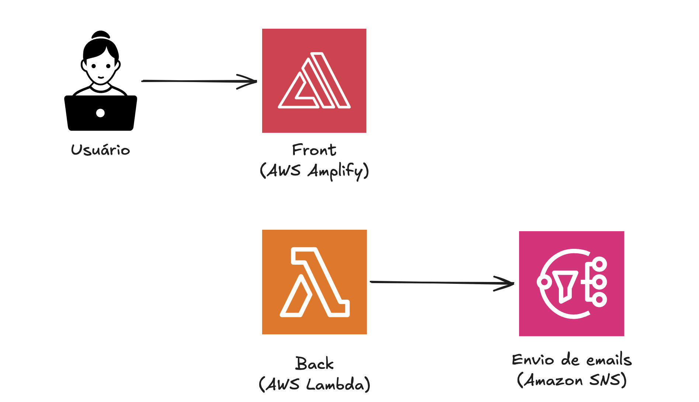

# Construa sua página pessoal com a nova experiência de sign-up da AWS

Esse repositório contém o código e o passo a passo para você construir sua página pessoal gratuitamente na AWS! Vamos construir um portfólio profissional completo com um formulário para contato!

## O que é a nova experiência de sign-up da AWS

TBD

# O que vamos construir

Nosso portfolio será uma página web com funcionalidade de envio de emails. Então, podemos imaginar em alto nível que vamos precisar de:

- Um frontend para o conteúdo estático
- Um backend para a lógica de envio 
- Um serviço que nos auxilie no envio de emails

## Arquitetura

TBD: Explicação da arquitetura

## Pré-requisitos
- Uma conta AWS (gratuita!)
- Um assistente de IA (no workshop usaremos o Kiro, porém ele podem ser replicado com outros assistentes)

## Passos
- Criar uma conta AWS 
- Conectar seu assistente de IA com Agent Toolkit
- Fazer planejamento da sua aplicação com assistente de IA
- Criar página web 
- Fazer deploy da página web estática na AWS com Agent Toolkit
- Configurar serviço de envio de emails na AWS com Agent Toolkit
- Criar lógica backend para envio de emails
- Fazer deploy do backend na AWS com Agent Toolkit

## Próximos passos
Para evoluir nosso portfólio pessoal, que tal incluir nossos projetos de forma dinâmica? Como desafio, experimente expandir nosso backend para se conectar com a API do github e buscar as informações dos seus repositórios. Dessa forma, todo novo projeto já estará incluído na sua página pessoal!
